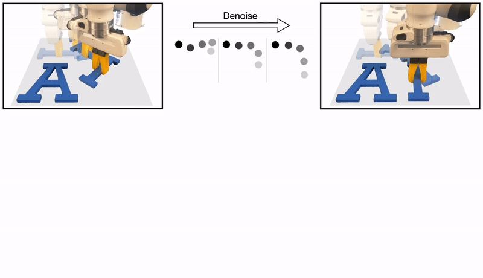

# Equivariant Diffusion Policy
[Project Website](https://equidiff.github.io) | [Paper](https://arxiv.org/pdf/2407.01812) | [Video](https://youtu.be/xIFSx_NVROU?si=MaxsHmih6AnQKAVy)  
<a href="https://pointw.github.io/">Dian Wang</a><sup>1</sup>, <a href="https://www.linkedin.com/in/stephen-hart-3711666/">Stephen Hart</a><sup>2</sup>, <a href="https://www.linkedin.com/in/surovik/">David Surovik</a><sup>2</sup>, <a href="https://kelestemur.com">Tarik Kelestemur</a><sup>2</sup>, <a href="https://haojhuang.github.io/">Haojie Huang</a><sup>1</sup>, <a href="https://www.linkedin.com/in/haibo-zhao-b68742250/">Haibo Zhao</a><sup>1</sup>, <a href="https://www.linkedin.com/in/mark-yeatman-58a49763/">Mark Yeatman</a><sup>2</sup>, <a href="https://www.robo.guru/">Jiuguang Wang</a><sup>2</sup>, <a href="https://www.robinwalters.com/">Robin Walters</a><sup>1</sup>, <a href="https://helpinghandslab.netlify.app/people/">Robert Platt</a><sup>12</sup>  
<sup>1</sup>Northeastern Univeristy, <sup>2</sup>Boston Dynamics AI Institute  
Conference on Robot Learning 2024 (Oral)
 | 
## Installation
1.  Install the following apt packages for mujoco:
    ```bash
    sudo apt install -y libosmesa6-dev libgl1-mesa-glx libglfw3 patchelf
    ```
1. Install gfortran (dependancy for escnn) 
    ```bash
    sudo apt install -y gfortran
    ```

1. Install [Mambaforge](https://github.com/conda-forge/miniforge#mambaforge) (strongly recommended) or Anaconda
1. Clone this repo
    ```bash
    git clone https://github.com/pointW/equidiff.git
    cd equidiff
    ```
1. Install environment:
    Use Mambaforge (strongly recommended):
    ```bash
    mamba env create -f conda_environment.yaml
    conda activate equidiff
    ```
    or use Anaconda (not recommended): 
    ```bash
    conda env create -f conda_environment.yaml
    conda activate equidiff
    ```
1. Install mimicgen:
    ```bash
    cd ..
    git clone https://github.com/NVlabs/mimicgen_environments.git
    cd mimicgen_environments
    # This project was developed with Mimicgen v0.1.0. The latest version should work fine, but it is not tested
    git checkout 081f7dbbe5fff17b28c67ce8ec87c371f32526a9
    pip install -e .
    cd ../equidiff
    ```
1. Make sure mujoco version is 2.3.2 (required by mimicgen)
    ```bash
    pip list | grep mujoco
    ```

## Dataset
### Download Dataset
```bash
# Download all datasets
python equi_diffpo/scripts/download_datasets.py --tasks stack_d1 stack_three_d1 square_d2 threading_d2 coffee_d2 three_piece_assembly_d2 hammer_cleanup_d1 mug_cleanup_d1 kitchen_d1 nut_assembly_d0 pick_place_d0 coffee_preparation_d1
# Alternatively, download one (or several) datasets of interest, e.g.,
python equi_diffpo/scripts/download_datasets.py --tasks stack_d1
```
### Generating Voxel and Point Cloud Observation

```bash
# Template
python equi_diffpo/scripts/dataset_states_to_obs.py --input data/robomimic/datasets/[dataset]/[dataset].hdf5 --output data/robomimic/datasets/[dataset]/[dataset]_voxel.hdf5 --num_workers=[n_worker]
# Replace [dataset] and [n_worker] with your choices.
# E.g., use 24 workers to generate point cloud and voxel observation for stack_d1
python equi_diffpo/scripts/dataset_states_to_obs.py --input data/robomimic/datasets/stack_d1/stack_d1.hdf5 --output data/robomimic/datasets/stack_d1/stack_d1_voxel.hdf5 --num_workers=24
```

### Convert Action Space in Dataset
The downloaded dataset has a relative action space. To train with absolute action space, the dataset needs to be converted accordingly
```bash
# Template
python equi_diffpo/scripts/robomimic_dataset_conversion.py -i data/robomimic/datasets/[dataset]/[dataset].hdf5 -o data/robomimic/datasets/[dataset]/[dataset]_abs.hdf5 -n [n_worker]
# Replace [dataset] and [n_worker] with your choices.
# E.g., convert stack_d1 (non-voxel) with 12 workers
python equi_diffpo/scripts/robomimic_dataset_conversion.py -i data/robomimic/datasets/stack_d1/stack_d1_voxel.hdf5 -o data/robomimic/datasets/stack_d1/stack_d1_abs.hdf5 -n 12
# E.g., convert stack_d1_voxel (voxel) with 12 workers
python equi_diffpo/scripts/robomimic_dataset_conversion.py -i data/robomimic/datasets/stack_d1/stack_d1_voxel.hdf5 -o data/robomimic/datasets/stack_d1/stack_d1_voxel_abs.hdf5 -n 12
```

## Training with image observation
To train Equivariant Diffusion Policy (with absolute pose control) in Stack D1 task:
```bash
# Make sure you have the non-voxel converted dataset with absolute action space from the previous step 
python train.py --config-name=train_equi_diffusion_unet_abs task_name=stack_d1 n_demo=100
```
To train with relative pose control instead:
```bash
python train.py --config-name=train_equi_diffusion_unet_rel task_name=stack_d1 n_demo=100
```
To train in other tasks, replace `stack_d1` with `stack_three_d1`, `square_d2`, `threading_d2`, `coffee_d2`, `three_piece_assembly_d2`, `hammer_cleanup_d1`, `mug_cleanup_d1`, `kitchen_d1`, `nut_assembly_d0`, `pick_place_d0`, `coffee_preparation_d1`. Notice that the corresponding dataset should be downloaded already. If training absolute pose control, the data conversion is also needed.

To run environments on CPU (to save GPU memory), use `osmesa` instead of `egl` through `MUJOCO_GL=osmesa PYOPENGL_PLATTFORM=osmesa`, e.g.,
```bash
MUJOCO_GL=osmesa PYOPENGL_PLATTFORM=osmesa python train.py --config-name=train_equi_diffusion_unet_abs task_name=stack_d1
```

Equivariant Diffusion Policy requires around 22G GPU memory to run with batch size of 128 (default). To reduce the GPU usage, consider training with smaller batch size and/or reducing the hidden dimension
```bash
# to train with batch size of 64 and hidden dimension of 64
MUJOCO_GL=osmesa PYOPENGL_PLATTFORM=osmesa python train.py --config-name=train_equi_diffusion_unet_abs task_name=stack_d1 policy.enc_n_hidden=64 dataloader.batch_size=64
```

## Training with voxel observation
To train Equivariant Diffusion Policy (with absolute pose control) in Stack D1 task:
```bash
# Make sure you have the voxel converted dataset with absolute action space from the previous step 
python train.py --config-name=train_equi_diffusion_unet_voxel_abs task_name=stack_d1 n_demo=100
```

## License
This repository is released under the MIT license. See [LICENSE](LICENSE) for additional details.

## Acknowledgement
* Our repo is built upon the origional [Diffusion Policy](https://github.com/real-stanford/diffusion_policy)
* Our ACT baseline is adaped from its [original repo](https://github.com/tonyzhaozh/act)
* Our DP3 baseline is adaped from its [original repo](https://github.com/YanjieZe/3D-Diffusion-Policy)
